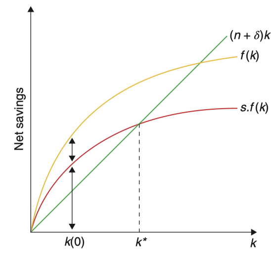

# 资本运动定律

将某一时刻资本存量两边同除$L$：

$$
\begin{aligned}\dot{K} =&s\cdot F\left( K,L \right) -\delta K\\ \frac{\dot{K}}{L} \left( \text{人均资本量} \right) =&s\cdot f\left( k \right) \text{（人均产出）} -\delta k\end{aligned}
$$

现已定义$k\equiv \frac{K}{L}$，对其在时间上进行微分：
$$
\dot{k} \equiv \frac{d\left( \frac{K}{L} \right)}{dt} =\frac{\dot{K} L-K\dot{L}}{L^{2}} =\frac{\dot{K}}{L} -\frac{K}{L} \cdot \frac{\dot{L}}{L} =\frac{\dot{K}}{L} -nk
$$

其中，$n=\frac{\dot{L}}{L}$为人口增长率。移项可得：
$$
\frac{\dot{K}}{L} =\dot{k} +nk
$$
代入最上面式子的左侧并移项：
$$
\dot{k}=s\cdot f(k)-(\delta+n) k
$$
$(\delta+n)$在 式右侧可以被视为资本 / 劳动比率的有效折旧率。如果储蓄率$s$为 0，那么 $k$ 的下降可能是因为$K$的折旧率$\delta$上升，也有可能是因为$L$的增长率$n$上升。

（补充罗默书说明）

这是 Solow 模型的关键方程，它表明了单位有效劳动平均资本存量的变化率是以下两项之差：

- 第一项是$sf(k)$，由于单位有效劳动的平均产出是$f(k)$， 其中用于投资的比例是$s$，因此这一项即为单位有效劳动的实际投资
- 第二项是 $(n+\delta)k$，也叫持平投资，它代表了使得$k$保持在现有水平所需要的投资量。 

为了防止$k$不断减少，追加一定数量的投资是必要的，其理由有两点：

- 一是现有资本会折旧，折旧的这部分资本必须得到补偿才能防止资本存量下降，这就是$\delta k$项

- 二是有效劳动的数量在增加，因此仅仅保持资本存量$K$不变的投资（即补偿折旧的投资）并不足以保持单位有效劳动的平均资本存量$k$不变。实际上，由于有效劳动数量的增长率为$n$，资本存量的增长率也必须是$n$才能保持$k$不变，就是$nk$项。

下图说明了这一变化的作用：

