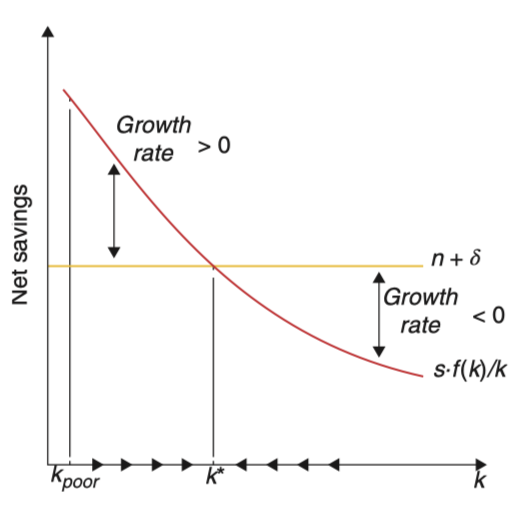

# 过渡动态

> [!Note]
>
> **何为「过渡动态？」**
>
> 「动态」说明描述的是一个过程，而「过渡」则是向前面所描述的 BGP 过渡，也就是受到内外部冲击或政策变化后（在在此处为储蓄率变化）从非 BGP 过渡到 BGP 时关键经济变量（如资本存量、产出和消费）随时间的动态演变。

此外，Solow 模型在向 BGP 过渡的过程中也实现了增长

$$
\dot{k}=sf(k)-(n+\delta)k
$$

现令$\gamma_k \equiv \frac{\dot{k}}{k}$，则有

$$
\gamma_k = \frac{sf(k)}{k}-(n+\delta)
$$

在没到达BGP前，$\frac{sf(k)}{k}$是一个单调递减的函数，而$n+\delta$是一条水平直线，可以推论出BGP时的$k^{\ast}>0$存在且唯一。

进行微分：

$$
	\frac{d\dot{k}}{dk}=s\cdot f^{\prime}\left(k\right)-\left(n+\delta\right)
$$

现代入BGP状态下的$k^\ast$，可以看到 BGP 点两边时的收敛趋势：

$$
	\left.\frac{d\dot{k}}{dk}\right|_{k=k^{*}}=s\cdot f^{\prime}\left(k^{*}\right)-\left(n+\delta\right)
$$

可以看到，当满足（A）当$k<k^\ast$时$\dot{k}>0$和（B）当$k>k^\ast$时$\dot{k}<0$，资本存量$k^\ast$会收敛至 BGP，此时$\left.\frac{d\dot{k}}{dk}\right|_{k=k^{*}} <0$。

在 CD 函数条件下，这相当于
$$
	\left.\frac{d\dot{k}}{dk}\right|_{k=k^{*}}=s\cdot A\alpha\left(\frac{sA}{n+\delta}\right)^{-1}-(n+\delta)=(n+\delta)\left(\alpha-1\right)
$$

若要满足$\left.\frac{d\dot{k}}{dk}\right|_{k=k^{*}} <0$，则需要$\alpha <1$——这意味着达到BGP的条件是边际收益递减。

边际收益递减意味着，如果人均资本$k$比较小，那么其边际产出$f^{\prime}(k)$相对较高。根据假设，储蓄率$s$恒定，因此人均资本$k$比较小时，投资储蓄的边际汇报$sf^{\prime}(k)$相对较高。又已知人均资本$k$以恒定的速率$n+\delta$进行折旧，因此此时资本增长$\dot{k}$也比较高。总而言之，$k<k^\ast$时，人均资本增长$\dot{k}$为正；$k>k^\ast$时，人均资本增长$\dot{k}$为负。
