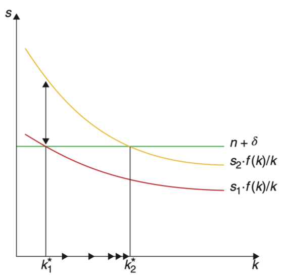
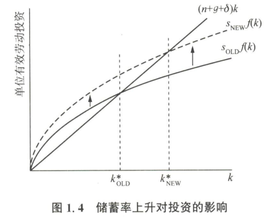
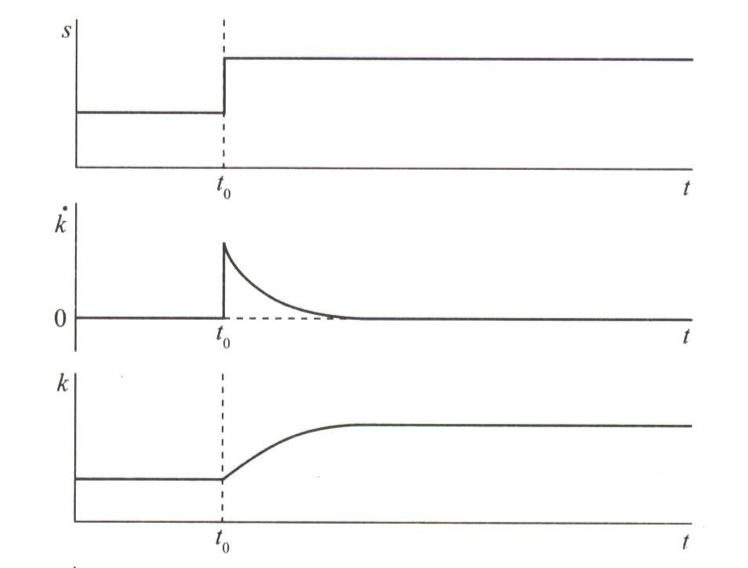

# 政策实验

初始状态下，假设经济处于$k^{\ast}_1$的BGP中，随后某项政策使得储蓄率$s$上升，那么$\frac{sf(k)}{k}$向右移动，新的BGP资本存量$k^{\ast}_2 > k^{\ast}_1$。

短期内，人均增长率上升，长期来看，技术的永久性提升会带来更高的$k, y$但人均增长率不会变化。

（补充罗默书）

$s$的增加会使实际投资曲线向上移动，从而使$k^*$上升，如图所示，但$k$的这种变化并不是瞬间实现的。一开始，$k$仍然等于原来的$k$值，但在这一水平上，实际投资是超过持平投资的，即用于投资的资源多于维持$k$不变所需的水平，因此$k$为正数，$k$会开始上涨并一直上涨到新的$\dot{k}$值，此后$k$会在这个新的$k^*$值上保持不变。

下图中的前三幅小图即描绘了上述结论。$t_0$表示储蓄率出现增加的时刻， 根据假设，$s$在时刻$t_0$突然上升并在此后保持不变。$s$的突然增加使实际投资严格大于持平投资，因此$\dot{k}$将从0跳跃至一个严格为正的值，而$k$则从原来的$k^*$值逐渐上升至新的$k^*$值，与此同时$\dot{k}$也随之逐渐回到零值。

