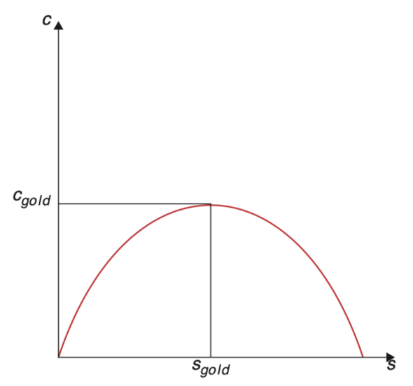

# 动态无效性

已知
$$
	s\cdot f(k^{\ast}) = (n+\delta)k^{\ast} 
$$

又

$$
	c^{\ast}=(1-s)f[k^{\ast}(s)]
$$

因此
$$
	c^{\ast}(s)=f[k^{\ast}(s)]-(n+\delta)k^{\ast}
$$

对储蓄率求偏导
$$
\frac{\partial c^{\ast}\left( s \right)}{\partial s} =\frac{\partial c^{\ast}\left( s \right)}{\partial k^{\ast}} \cdot \frac{\partial k^{\ast}(s)}{\partial s} =\left[ f^\prime \left( k^{\ast} \right) -\left( n+\delta \right) \right] \cdot \frac{\partial k^{\ast}(s)}{\partial s} 
{{numeq}}

$$

在(1.7.1)中，$k^{\ast}(s)$表示，每个$s$对应一个BGP状态下的$k^\ast$，已知储蓄率高的状态下人均资本量也高，因此可得$\frac{dk^{\ast}(s)}{ds}>0$。

因此若想让$c^{\ast}(s)$水平最高，条件为$f^\prime(k)=n+\delta$，此时的消费率称为**黄金法则下的消费率(the “golden rule” consumption rate)**：$c_g=f(k_g)-(n+\delta)k_g$

此外，$[f' \left( k^{\ast} \right) -\left( n+\delta \right)]$的正负取决于决定$k^{\ast}$的$s$，同样已知储蓄率高的状态下人均资本量也高，那么这意味着最佳消费水平$c^{\ast}$在$s$低水平时随$s$增加而增加，在$s$低水平时随$s$增加而减少。

这里可以得出的结论是：若实际储蓄率高于$s_g$，那么经济体仍然可以在 BGP 或在向 BGP 转型的时期提升消费。即当资本存量过高时，资本的边际产出低于储蓄率，导致过度的资本积累，这就是动态无效性。