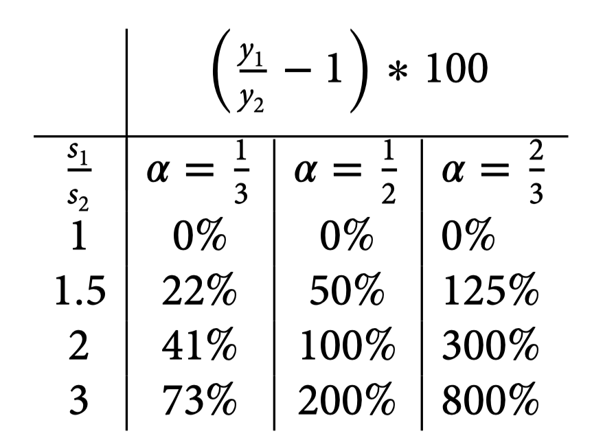

# 是否可以解释收入差异？

前面已经得到，CD 函数条件下的的 BGP 为：
$$
k^{\ast}=\left(\frac{sA}{n+\delta}\right)^{\frac{1}{1-\alpha}}=A^{\frac{1}{1-\alpha}}\left(\frac{s}{n+\delta}\right)^{\frac{\alpha}{1-\alpha}}\quad (0<\alpha<1)
$$

现令$A=1, n=0$
$$
y^{\ast}=\left(\frac{s}{\delta} \right)^{\frac{\alpha}{1-\alpha}}
$$
Solow 模型是否能解释BGP状态下收入差异的能力取决于$\alpha$的值
$$
\mathrm{If}\begin{cases}\alpha=\frac{1}{3}\mathrm{then}\frac{\alpha}{1-\alpha}=\frac{1/3}{2/3}=\frac{1}{2}\\\alpha=\frac{1}{2}\mathrm{then}\frac{\alpha}{1-\alpha}=\frac{1/2}{1/2}=1\\\alpha=\frac{2}{3}\mathrm{then}\frac{\alpha}{1-\alpha}=\frac{2/3}{1/3}=2&\end{cases}
$$
资本份额的标准（粗略）估值为1/3。然而Parente与Prescott(2002)提出，由于存在大量无形资本资产，GDP中的资本份额远超常规测算值。事实上，他们认为GDP中的投资占比应接近三分之二，而非传统认知的三分之一。未计入投资的成因包括（他们的具体估算数据分别为）：

1. 设备维修保养（占GDP的5%）
2. 研发支出（占GDP的3%）乘以三倍（即GDP的9%）——用于核算生产工艺改进及新产品推出成本（这个「三倍」缺乏充分依据）
3. 软件投资（占GDP的3%）
4. 企业组织资本投入（他们认为12%是合理估值）
5. 在职学习与培训（占GDP的10%）
6. 学校教育支出（占GDP的5%）

他们声称所有这些资本都有回报，约占 GDP 总量的 56%。使用上述方程可以用它来估计收入水平差异。

即使使用三分之二估计得到的 800%，相对于我们在数据中看到的情况来说，似乎还是太低了。

另有一种可能：收入差异可能来自全要素生产率（ TFP ）的差异，如参数 $A$ 所捕捉的那样。问题是：这些差异需要多大才能解释产出差异？

因此，如果 $\alpha= 2 ∕ 3$，如 Parente 和 Prescott （ 2002 ）理论，那么
$$
A^{\frac{1}{1-\alpha}}=A^{\frac{1}{1-2/3}}=A^3
$$
这意味着，如果某国 TFP 是即另一国1/3的水平，这表明收入水平则为该国的 1 ∕ 27。

